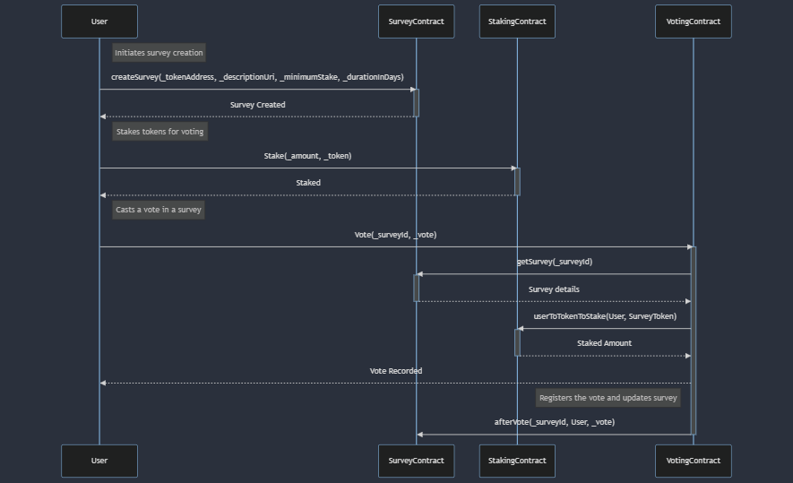

# Part 2


## Introduction

This project solves Part2 using a Hardhat project.
It comes with a test file testing the deployment and all workflows.


You can run it using:

```shell
npx hardhat test
```

---
## Contracts

This architecture includes 3 contracts:

- BarERC20: An ERC20 token, here used for staking
- StakingContract: responsible for the staking logic
- SurveyContract: responsible for the survey creation and management
- VotingContract: responsible for the voting logic, connected to the other 2


---

## Diagram
Here is a sequence diagram of the contracts and their interactions:




---

## Test coverage


```sql
----------------------|----------|----------|----------|----------|----------------|
File                  |  % Stmts | % Branch |  % Funcs |  % Lines |Uncovered Lines |
----------------------|----------|----------|----------|----------|----------------|
contracts\            |      100 |       75 |      100 |      100 |                |
BarERC20.sol          |      100 |      100 |      100 |      100 |                |
StakingContract.sol   |      100 |       75 |      100 |      100 |                |
SurveyContract.sol    |      100 |    77.27 |      100 |      100 |                |
VotingContract.sol    |      100 |    71.43 |      100 |      100 |                |
----------------------|----------|----------|----------|----------|----------------|
All files             |      100 |       75 |      100 |      100 |                |
----------------------|----------|----------|----------|----------|----------------|
```

----

## Possible Improvements

 - Implement a Pausable strategy
 - Add Arbitration (in case of a hack, to render a survey null)
 - Add NFT staking to  voting conditions
 - Use Viem instead of Ethers (didn't have time to find good viem tools for UUPS proxy deployments)
 - Add a locking period in staking contract. Tokens are locked for the duration of the survey and can be redeemed after the end timestamp.
